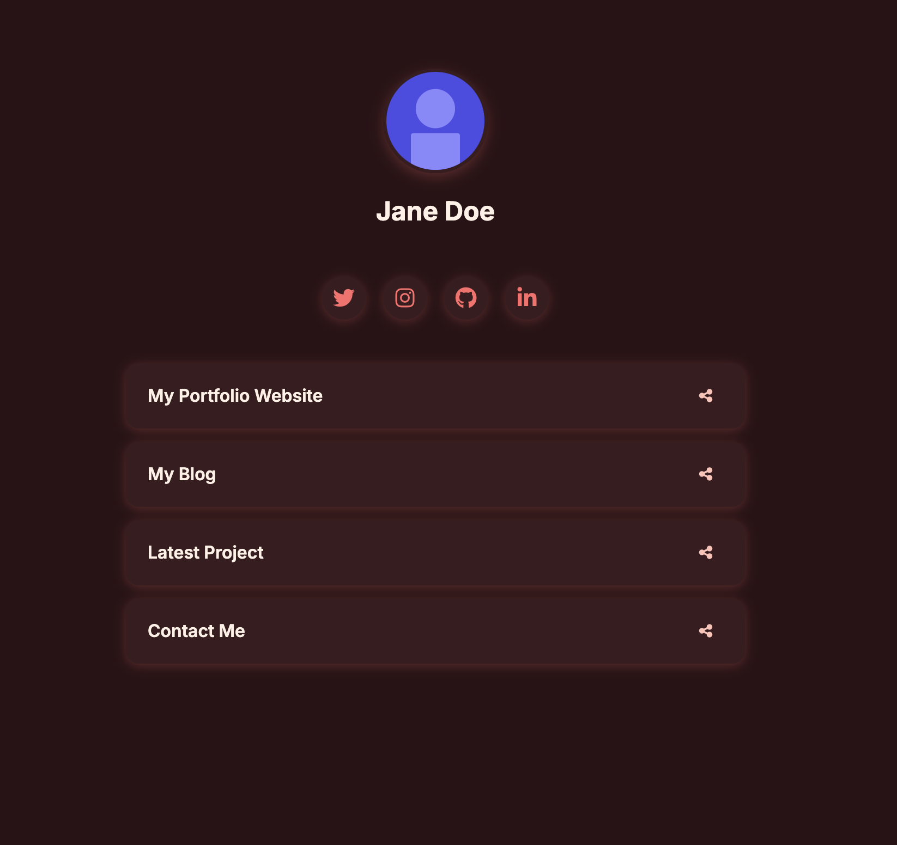

# AstroLink

A modern, responsive link-in-bio website built with Astro.js.

<div align="center">
  
  <p><em>AstroLinks with the "sunset" theme</em></p>
</div>

## Features

- Clean, modern UI with predefined themes (light, dark, sunset, earthy, sunrise)
- Profile picture and name display
- Social media icons
- Custom link buttons with share functionality
- Responsive design for all devices
- Fast loading and accessibility focused

## Getting Started

### Prerequisites

- Node.js (v14 or higher)
- npm or yarn

### Installation

1. Clone the repository
   ```
   git clone https://github.com/adnandossaji/astrolink.git
   cd astro-links
   ```

2. Install dependencies
   ```
   npm install
   # or
   yarn
   ```

3. Start the development server
   ```
   npm run dev
   # or
   yarn dev
   ```

4. Build for production
   ```
   npm run build
   # or
   yarn build
   ```

## Customization

- Edit `src/content/config/site.yaml` to customize your profile info, social links, and theme
- Replace the profile image in `public/images/profile.svg` with your own
- Choose from five predefined themes: light, dark, sunset, sunrise, or earthy

## Theming System

AstroLinks includes a robust theming system with five predefined themes:

- **light** - Clean white background with purple accents
- **dark** - Dark background with vibrant purple accents
- **sunset** - Dark reddish theme with warm accents
- **sunrise** - Light yellow theme with orange accents
- **earthy** - Natural green theme with earth tones

### How Theming Works

1. Themes are defined in `src/styles/themes.ts` as TypeScript objects
2. The selected theme from `site.yaml` is applied using the `ThemeProvider` component
3. Global CSS variables are set in `src/styles/global.css`
4. To create your own theme:
   - Add your theme to the `ThemeType` in `src/styles/themes.ts`
   - Add your theme configuration to the `themeStyles` object
   - Add your theme option to the schema in `src/content/config.ts`

## License

MIT

## Credits

Built with [Astro](https://astro.build) - the all-in-one web framework designed for speed.

```sh
yarn create astro@latest -- --template minimal
```

[](https://stackblitz.com/github/withastro/astro/tree/latest/examples/minimal)
[](https://codesandbox.io/p/sandbox/github/withastro/astro/tree/latest/examples/minimal)
[](https://codespaces.new/withastro/astro?devcontainer_path=.devcontainer/minimal/devcontainer.json)

> 🧑‍🚀 **Seasoned astronaut?** Delete this file. Have fun!

## 🚀 Project Structure

Inside of your Astro project, you'll see the following folders and files:

```text
/
├── public/
│   └── images/           # Image assets
├── src/
│   ├── components/       # Reusable components
│   │   ├── LinkButton.astro
│   │   ├── LinksList.astro
│   │   ├── Profile.astro
│   │   ├── SocialLinks.astro
│   │   └── ThemeProvider.astro
│   ├── content/
│   │   ├── config/
│   │   │   └── site.yaml # Your site configuration
│   │   └── config.ts     # Content schema definitions
│   ├── layouts/
│   │   └── Layout.astro  # Main site layout
│   ├── pages/
│   │   └── index.astro   # Main page
│   └── styles/           # Global styles and theme definitions
│       ├── global.css    # Global CSS
│       └── themes.ts     # Theme definitions
└── package.json
```

Astro looks for `.astro` or `.md` files in the `src/pages/` directory. Each page is exposed as a route based on its file name.

The `src/content/config/` directory contains configuration files like `site.yaml` where you can customize your profile, links, and theme.

The `src/styles/` directory contains global styles and theme definitions, allowing for easy customization of the site appearance.

## 🧞 Commands

All commands are run from the root of the project, from a terminal:

| Command                   | Action                                           |
| :------------------------ | :----------------------------------------------- |
| `yarn install`             | Installs dependencies                            |
| `yarn dev`             | Starts local dev server at `localhost:4321`      |
| `yarn build`           | Build your production site to `./dist/`          |
| `yarn preview`         | Preview your build locally, before deploying     |
| `yarn astro ...`       | Run CLI commands like `astro add`, `astro check` |
| `yarn astro -- --help` | Get help using the Astro CLI                     |

## 👀 Want to learn more?

Feel free to check out the [Astro documentation](https://docs.astro.build).